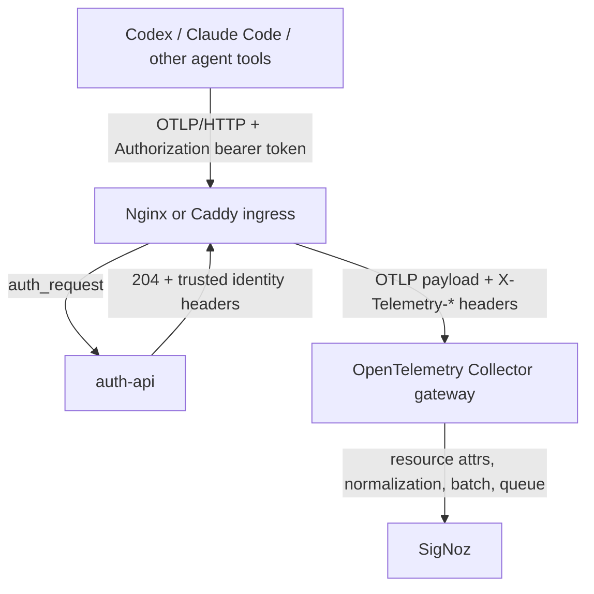

# Architecture

This project is an authenticated OpenTelemetry gateway for agent telemetry. It
is designed as a small internal product with a control plane, ingress, Collector
gateway, client config generators, SigNoz bootstrap, and dashboards.

## System Diagram



## Core Request Flow

1. Agent tools post telemetry to `/v1/logs`, `/v1/traces`, or `/v1/metrics`.
2. Ingress calls `auth-api` through an internal auth subrequest.
3. `auth-api` validates an opaque bearer token and returns identity headers.
4. Ingress overwrites any spoofed client identity headers with trusted values
   from `auth-api`.
5. The Collector receives OTLP/HTTP with `include_metadata: true`.
6. Collector processors copy trusted request headers into resource attributes.
7. The Collector normalizes a small set of agent fields, batches, queues, and
   exports to SigNoz.
8. SigNoz stores logs, traces, and metrics with consistent user, team, token,
   and tool dimensions.

## Components

### auth-api

The token/control-plane service owns users, teams, tokens, token revocation, and
ingest audit records. The first version uses FastAPI and SQLite with a schema
that can move to Postgres later.

The service is not a public admin API in v1. Token issuance and user management
should run through `otelctl` with local DB access or an internal-only admin
path.

### Authenticated Ingress

Nginx is the baseline ingress because `auth_request` keeps the OTLP request body
untouched while delegating identity checks to `auth-api`. The ingress should
only accept these OTLP/HTTP paths:

```text
/v1/logs
/v1/traces
/v1/metrics
```

For production, terminate TLS before traffic reaches the gateway. Caddy is a
reasonable alternative if automatic certificate management is more important
than matching existing Nginx infrastructure.

### Collector Gateway

The Collector is the enforcement and enrichment point after auth. It should:

- receive OTLP/HTTP from ingress only
- use request metadata to enrich resource attributes
- normalize only the fields required for dashboards
- preserve native Codex and Claude Code telemetry fields
- use memory limits, batching, exporter queues, and retry-on-failure
- export to SigNoz over the internal Docker network or private subnet

Use `otel/opentelemetry-collector-contrib`, not the core-only image. The contrib
distribution gives room for processors and exporters that are likely to be
needed as the trial grows.

### SigNoz

SigNoz is the v1 backend for UI, dashboards, logs, traces, metrics, and
ClickHouse-backed storage. Teammates should not post directly to SigNoz's OTLP
ports. All external ingestion goes through the authenticated gateway.

## Trust Boundaries

- External clients can provide `Authorization` only.
- External clients cannot be trusted for `X-Telemetry-*` identity headers.
- Ingress must overwrite identity headers before proxying to the Collector.
- Ingress must derive source IP from the socket or a configured trusted proxy
  chain. Do not trust client-supplied `X-Forwarded-For` directly.
- Collector enrichment must use trusted metadata from ingress, not payload
  fields supplied by clients.
- SigNoz ingestion ports should stay internal.

## Local Port Plan

| Component | Port | Exposure |
| --- | ---: | --- |
| Nginx gateway | 8088 | Local host or public edge in production |
| auth-api | 8000 | Internal Docker network |
| Collector OTLP/HTTP | 4318 | Internal Docker network |
| Collector OTLP/gRPC to SigNoz | 4317 | Internal Docker network |
| SigNoz UI | 8080 | Local host or authenticated internal UI |

## Baseline Collector Config

```yaml
receivers:
  otlp:
    protocols:
      http:
        endpoint: 0.0.0.0:4318
        include_metadata: true
processors:
  memory_limiter:
    check_interval: 1s
    limit_mib: 1024
    spike_limit_mib: 256
  resource/tenant_from_headers:
    attributes:
      - key: telemetry.user.email
        from_context: metadata.x-telemetry-user
        action: upsert
      - key: telemetry.user.id
        from_context: metadata.x-telemetry-user-id
        action: upsert
      - key: telemetry.team.id
        from_context: metadata.x-telemetry-team
        action: upsert
      - key: telemetry.token.id
        from_context: metadata.x-telemetry-token-id
        action: upsert
      - key: telemetry.source.ip
        from_context: metadata.x-telemetry-source-ip
        action: upsert
      - key: agent.capture.profile
        from_context: metadata.x-telemetry-capture-profile
        action: upsert
      - key: service.namespace
        value: agent-otel
        action: upsert
  transform/agent_normalize:
    error_mode: ignore
    log_statements:
      - context: resource
        statements:
          - set(attributes["agent.tool"], "codex") where attributes["service.name"] == "codex"
          - set(attributes["agent.tool"], "claude_code") where attributes["service.name"] == "claude-code"
    trace_statements:
      - context: resource
        statements:
          - set(attributes["agent.tool"], "codex") where attributes["service.name"] == "codex"
          - set(attributes["agent.tool"], "claude_code") where attributes["service.name"] == "claude-code"
    metric_statements:
      - context: resource
        statements:
          - set(attributes["agent.tool"], "codex") where attributes["service.name"] == "codex"
          - set(attributes["agent.tool"], "claude_code") where attributes["service.name"] == "claude-code"
  batch:
    send_batch_size: 1024
    timeout: 5s
exporters:
  otlp/signoz:
    endpoint: signoz-otel-collector:4317
    tls:
      insecure: true
    sending_queue:
      enabled: true
      queue_size: 5000
    retry_on_failure:
      enabled: true
      initial_interval: 5s
      max_interval: 30s
      max_elapsed_time: 10m
  debug:
    verbosity: basic
service:
  pipelines:
    logs:
      receivers: [otlp]
      processors: [memory_limiter, resource/tenant_from_headers, transform/agent_normalize, batch]
      exporters: [otlp/signoz, debug]
    traces:
      receivers: [otlp]
      processors: [memory_limiter, resource/tenant_from_headers, transform/agent_normalize, batch]
      exporters: [otlp/signoz, debug]
    metrics:
      receivers: [otlp]
      processors: [memory_limiter, resource/tenant_from_headers, transform/agent_normalize, batch]
      exporters: [otlp/signoz, debug]
```

## Source Notes

- OpenTelemetry Collector overview: https://opentelemetry.io/docs/collector/
- OpenTelemetry Collector gateway deployment pattern: https://opentelemetry.io/docs/collector/deploy/gateway/
- OpenTelemetry Collector contrib processors: https://github.com/open-telemetry/opentelemetry-collector-contrib/tree/main/processor
- Nginx subrequest authentication: https://docs.nginx.com/nginx/admin-guide/security-controls/configuring-subrequest-authentication/
- SigNoz self-hosted Docker install: https://signoz.io/docs/install/docker/
- SigNoz ingestion overview: https://signoz.io/docs/ingestion/self-hosted/overview/
