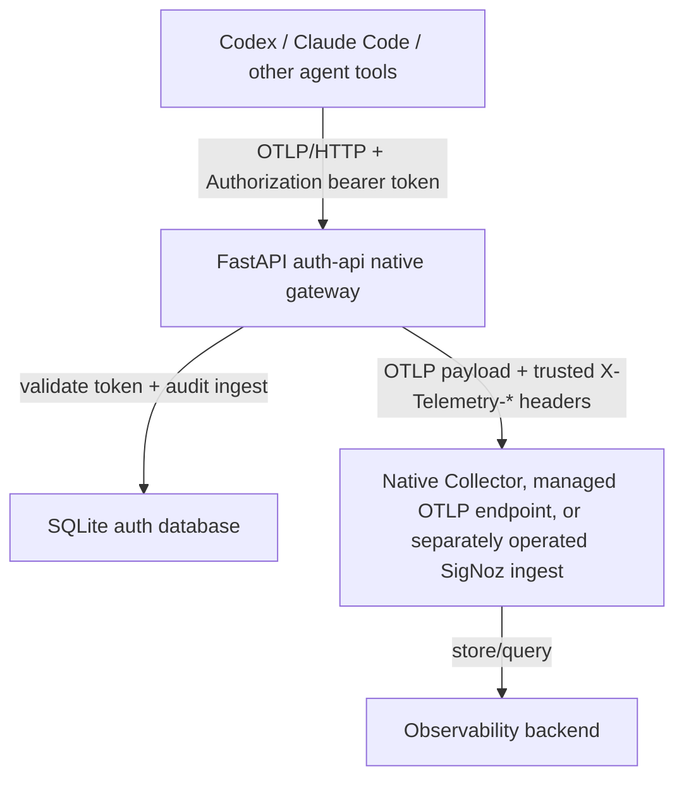

# Architecture

This project defines an authenticated native FastAPI OpenTelemetry gateway for
agent telemetry: control plane, OTLP/HTTP ingress, client config generators,
upstream forwarding, and dashboard/query references.

## System Diagram


```mermaid
flowchart TD
  A["Codex / Claude Code / other agent tools"] -->|"OTLP/HTTP + Authorization bearer token"| B["FastAPI auth-api native gateway"]
  B -->|"validate token + audit ingest"| C["SQLite auth database"]
  B -->|"OTLP payload + trusted X-Telemetry-* headers"| D["Native Collector, managed OTLP endpoint, or separately operated SigNoz ingest"]
  D -->|"store/query"| E["Observability backend"]
```

## Core Request Flow

1. Agent tools post telemetry to `/v1/logs`, `/v1/traces`, or `/v1/metrics`.
2. The FastAPI gateway validates an opaque bearer token against the shared auth
   database.
3. Invalid, unauthorized, unsupported, or oversized requests are rejected before
   forwarding.
4. The gateway overwrites any spoofed client `X-Telemetry-*` identity headers
   with trusted values from the token record.
5. The gateway forwards the original OTLP/HTTP body to `AOTEL_OTLP_UPSTREAM`.
6. The upstream collector or backend stores logs, traces, and metrics with
   consistent user, team, token, and tool dimensions.

## Components

### auth-api Native Gateway

The token/control-plane service owns users, teams, tokens, token revocation,
ingest audit records, and the native OTLP/HTTP gateway. V1 uses FastAPI and
SQLite with a schema that can move to Postgres later.

The service is not a public admin API in v1. Token issuance and user management
run through `otelctl` with local DB access or an internal-only admin path.

The gateway routes are implemented as normal FastAPI routes under:

```text
/v1/logs
/v1/traces
/v1/metrics
```

The router lives in `auth_api.gateway` so a future existing FastAPI application
can mount it directly instead of running this package as a standalone service.

### Upstream OTLP Backend

The repository runtime does not start Docker images. Configure
`AOTEL_OTLP_UPSTREAM` to point at one of:

- a native OpenTelemetry Collector installed as a local or host service
- a managed OTLP/HTTP endpoint
- a separately operated SigNoz ingest endpoint

```text
/v1/logs
/v1/traces
/v1/metrics
```

For production, terminate TLS before traffic reaches the FastAPI app or run the
app behind an existing non-Docker load balancer. If a native Collector is used,
install `otelcol-contrib` through the host package manager or release binary and
point `AOTEL_OTLP_UPSTREAM` at its OTLP/HTTP listener.

### SigNoz

SigNoz can still be the backend for UI, dashboards, logs, traces, metrics, and
ClickHouse-backed storage, but it is not started by this repository runtime. Do
not expose backend OTLP ports directly to teammates. All external ingestion
goes through the authenticated FastAPI gateway.

## Trust Boundaries

- External clients can provide `Authorization` and OTLP transport headers only.
- External clients cannot be trusted for `X-Telemetry-*` identity headers.
- The FastAPI gateway must overwrite identity headers before forwarding.
- The FastAPI gateway derives source IP from the request socket or hosting
  platform. Do not trust client-supplied `X-Forwarded-For` directly.
- Upstream enrichment must use trusted gateway metadata, not client payload
  fields supplied by clients.
- Backend ingestion ports must stay private.

## Local Port Plan

| Component | Port | Exposure |
| --- | ---: | --- |
| FastAPI auth/gateway | 8088 | Local host or public edge in production |
| Native Collector OTLP/HTTP | 4318 | Private upstream if used |
| SigNoz UI | 8080 | Optional authenticated internal UI |

## Optional Native Collector Config

```yaml
receivers:
  otlp:
    protocols:
      http:
        endpoint: 0.0.0.0:4318
        include_metadata: true
processors:
  memory_limiter:
    check_interval: 1s
    limit_mib: 1024
    spike_limit_mib: 256
  resource/tenant_from_headers:
    attributes:
      - key: telemetry.user.email
        from_context: metadata.x-telemetry-user
        action: upsert
      - key: telemetry.user.id
        from_context: metadata.x-telemetry-user-id
        action: upsert
      - key: telemetry.team.id
        from_context: metadata.x-telemetry-team
        action: upsert
      - key: telemetry.token.id
        from_context: metadata.x-telemetry-token-id
        action: upsert
      - key: telemetry.source.ip
        from_context: metadata.x-telemetry-source-ip
        action: upsert
      - key: agent.capture.profile
        from_context: metadata.x-telemetry-capture-profile
        action: upsert
      - key: service.namespace
        value: agent-otel
        action: upsert
  transform/agent_normalize:
    error_mode: ignore
    log_statements:
      - context: resource
        statements:
          - set(attributes["agent.tool"], "codex") where attributes["service.name"] == "codex"
          - set(attributes["agent.tool"], "claude_code") where attributes["service.name"] == "claude-code"
    trace_statements:
      - context: resource
        statements:
          - set(attributes["agent.tool"], "codex") where attributes["service.name"] == "codex"
          - set(attributes["agent.tool"], "claude_code") where attributes["service.name"] == "claude-code"
    metric_statements:
      - context: resource
        statements:
          - set(attributes["agent.tool"], "codex") where attributes["service.name"] == "codex"
          - set(attributes["agent.tool"], "claude_code") where attributes["service.name"] == "claude-code"
  batch:
    send_batch_size: 1024
    timeout: 5s
exporters:
  otlp/signoz:
    endpoint: 127.0.0.1:4317
    tls:
      insecure: true
    sending_queue:
      enabled: true
      queue_size: 5000
    retry_on_failure:
      enabled: true
      initial_interval: 5s
      max_interval: 30s
      max_elapsed_time: 10m
  debug:
    verbosity: basic
service:
  pipelines:
    logs:
      receivers: [otlp]
      processors: [memory_limiter, resource/tenant_from_headers, transform/agent_normalize, batch]
      exporters: [otlp/signoz, debug]
    traces:
      receivers: [otlp]
      processors: [memory_limiter, resource/tenant_from_headers, transform/agent_normalize, batch]
      exporters: [otlp/signoz, debug]
    metrics:
      receivers: [otlp]
      processors: [memory_limiter, resource/tenant_from_headers, transform/agent_normalize, batch]
      exporters: [otlp/signoz, debug]
```

## Source Notes

- OpenTelemetry Collector overview: https://opentelemetry.io/docs/collector/
- OpenTelemetry Collector gateway deployment pattern: https://opentelemetry.io/docs/collector/deploy/gateway/
- OpenTelemetry Collector contrib processors: https://github.com/open-telemetry/opentelemetry-collector-contrib/tree/main/processor
- Nginx subrequest authentication: https://docs.nginx.com/nginx/admin-guide/security-controls/configuring-subrequest-authentication/
- SigNoz self-hosted Docker install: https://signoz.io/docs/install/docker/
- SigNoz ingestion overview: https://signoz.io/docs/ingestion/self-hosted/overview/
