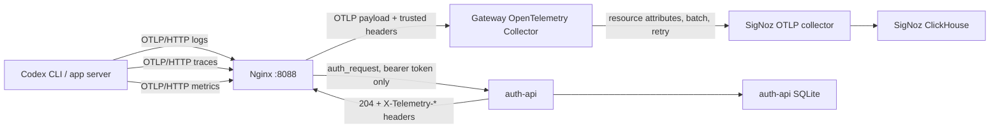
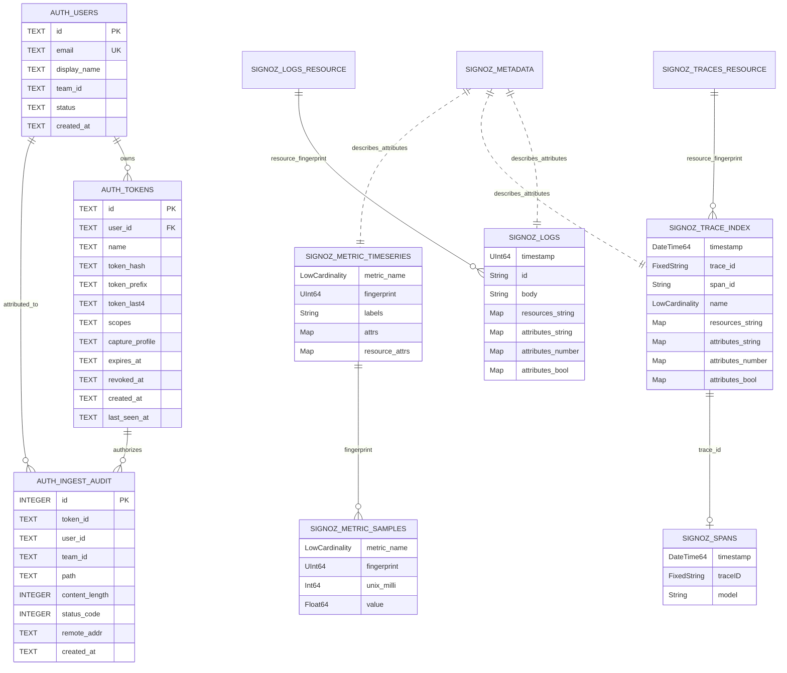

# Codex Telemetry Storage Map

This document describes the Codex telemetry currently emitted into the local
Agent OpenTelemetry trial and the storage surfaces used by SigNoz and the
gateway. It is based on the repo contracts plus a live local SigNoz/ClickHouse
inspection on 2026-05-28. Snapshot counts and observed field inventories are
diagnostic observations, not product contracts; refresh them against the running
local stack before relying on exact values.

## Scope

The storage model has two layers:

- SigNoz ClickHouse stores the OpenTelemetry logs, traces, metrics, and SigNoz
  metadata that operators query in the SigNoz UI.
- The gateway auth SQLite database stores users, token metadata, and per-ingest
  auth audit rows. It does not store OTLP request bodies.

Codex sends OTLP/HTTP to the gateway:

```text
POST http://localhost:8088/v1/logs
POST http://localhost:8088/v1/traces
POST http://localhost:8088/v1/metrics
Authorization: Bearer <redacted-token>
```

The installed Codex config observed locally has:

- `[otel].environment = "team-trial"`
- `[otel].log_user_prompt = false`
- separate OTLP/HTTP exporters for logs, metrics, and traces
- `protocol = "binary"` on each exporter
- bearer auth headers on each exporter

## Runtime Data Flow



## Storage Diagram



The ER diagram shows logical relationships. SigNoz uses ClickHouse distributed
tables and map columns rather than strict foreign keys.

## Trusted Gateway Attributes

`auth-api` returns these headers after token validation:

| Header | Collector resource attribute | Source |
| --- | --- | --- |
| `X-Telemetry-User` | `telemetry.user.email` | `users.email` |
| `X-Telemetry-User-Id` | `telemetry.user.id` | `users.id` |
| `X-Telemetry-Team` | `telemetry.team.id` | `users.team_id` |
| `X-Telemetry-Token-Id` | `telemetry.token.id` | `tokens.id` |
| `X-Telemetry-Capture-Profile` | `agent.capture.profile` | `tokens.capture_profile` |
| `X-Telemetry-Source-Ip` | `telemetry.source.ip` | Nginx source IP handling |

The Collector also sets `service.namespace = "agent-otel"`.

Current local Codex rows use `service.name = "codex_cli_rs"` and
`service.name = "codex-app-server"`. The current normalizer only sets
`agent.tool = "codex"` when `service.name == "codex"`, so live Codex rows may
need to be filtered by `service.name` until the normalizer also recognizes
`codex_cli_rs`.

## Current Live Snapshot

Observed local data on 2026-05-28:

| Surface | Rows |
| --- | ---: |
| `signoz_logs.distributed_logs_v2` | 4,516 plus ongoing writes |
| `signoz_traces.distributed_signoz_index_v3` | 6,097 plus ongoing writes |
| `signoz_metrics.distributed_metadata` | 6,697 |
| `signoz_metrics.distributed_time_series_v4` | 5,193 |
| `signoz_metrics.distributed_samples_v4` | 37,742 |
| `signoz_meter.distributed_samples` | 16 |
| `auth-api.users` | 3 |
| `auth-api.tokens` | 8 |
| `auth-api.ingest_audit` | 473 |

The row counts are a point-in-time diagnostic, not a fixture. Codex continued
to write telemetry while this document was being prepared.

To refresh this snapshot from a running local stack, use `DESCRIBE TABLE` for
the ClickHouse schemas and distinct-key queries over the relevant map columns.
For example:

```sh
docker exec signoz-clickhouse clickhouse-client \
  --query "DESCRIBE TABLE signoz_logs.distributed_logs_v2"

docker exec signoz-clickhouse clickhouse-client \
  --query "SELECT count() FROM signoz_logs.distributed_logs_v2"
```

For auth storage, run SQLite queries against the auth-api database configured by
`AUTH_API_DB_PATH`.

## Codex Logs

Primary table:

`signoz_logs.distributed_logs_v2`

| Column | Type | Meaning |
| --- | --- | --- |
| `ts_bucket_start` | `UInt64` | Bucket timestamp used by SigNoz indexes. |
| `resource_fingerprint` | `String` | Fingerprint for the resource attribute set. |
| `timestamp` | `UInt64` | Log event timestamp in nanoseconds. |
| `observed_timestamp` | `UInt64` | Collector-observed timestamp in nanoseconds. |
| `id` | `String` | SigNoz log row id. |
| `trace_id` | `String` | Trace id linked from log event when present. |
| `span_id` | `String` | Span id linked from log event when present. |
| `trace_flags` | `UInt32` | OpenTelemetry trace flags. |
| `severity_text` | `LowCardinality(String)` | Text severity. |
| `severity_number` | `UInt8` | Numeric severity. |
| `body` | `String` | Log body. Current Codex rows observed empty bodies. |
| `attributes_string` | `Map(String,String)` | String log attributes. |
| `attributes_number` | `Map(String,Float64)` | Numeric log attributes. |
| `attributes_bool` | `Map(String,Bool)` | Boolean log attributes. |
| `resources_string` | `Map(String,String)` | Resource attributes, including trusted user/team/token fields. |
| `scope_name` | `String` | Instrumentation scope name. |
| `scope_version` | `String` | Instrumentation scope version. |
| `scope_string` | `Map(String,String)` | Scope attributes. |
| `_retention_days` | `UInt16` | Hot retention marker, default `15`. |
| `_retention_days_cold` | `UInt16` | Cold retention marker, default `0`. |
| `resource` | `JSON` | JSON projection of resource attributes. |

Companion table:

`signoz_logs.distributed_logs_v2_resource`

| Column | Type | Meaning |
| --- | --- | --- |
| `labels` | `String` | Encoded resource labels. |
| `fingerprint` | `String` | Resource fingerprint. |
| `seen_at_ts_bucket_start` | `Int64` | First/last bucket tracking for resource visibility. |
| `_retention_days` | `UInt16` | Hot retention marker, default `15`. |
| `_retention_days_cold` | `UInt16` | Cold retention marker, default `0`. |

Observed Codex log event names:

| Event name | Purpose |
| --- | --- |
| `codex.api_request` | API request accounting. |
| `codex.conversation_starts` | Conversation/session starts. |
| `codex.sse_event` | Streaming event accounting. |
| `codex.startup_phase` | Startup phase timing/status. |
| `codex.tool_decision` | Tool approval/decision events. |
| `codex.tool_result` | Tool execution result events. |
| `codex.turn_ttft` | Time-to-first-token turn events. |
| `codex.user_prompt` | User prompt events. |
| `codex.websocket_connect` | WebSocket connection events. |
| `codex.websocket_event` | WebSocket event accounting. |
| `codex.websocket_request` | WebSocket request accounting. |

Observed Codex log resource keys:

```text
agent.capture.profile
env
host.name
service.name
service.namespace
service.version
telemetry.sdk.language
telemetry.sdk.name
telemetry.sdk.version
telemetry.source.ip
telemetry.team.id
telemetry.token.id
telemetry.user.email
telemetry.user.id
```

Observed Codex string log attribute keys:

```text
app.version
approval_policy
arguments
auth.header_name
auth.mode
auth_mode
call_id
conversation.id
decision
duration_ms
endpoint
error.message
event.kind
event.name
event.timestamp
input_token_count
mcp_server
mcp_server_origin
mcp_servers
model
originator
output
output_token_count
prompt
prompt_length
provider_name
reasoning_effort
reasoning_summary
sandbox_policy
slug
source
startup.phase
startup.status
success
terminal.type
tool_name
tool_token_count
user.account_id
user.email
```

Observed Codex numeric log attribute keys:

```text
attempt
cached_token_count
http.response.status_code
reasoning_token_count
```

Observed Codex boolean log attribute keys:

```text
auth.connection_reused
auth.env_codex_api_key_enabled
auth.env_codex_api_key_present
auth.env_openai_api_key_present
auth.env_refresh_token_url_override_present
auth.header_attached
auth.retry_after_unauthorized
success
```

Prompt note: the live local data contained `codex.user_prompt` log rows with
`prompt` and `prompt_length` attributes even though the observed config has
`log_user_prompt = false`. Treat prompt text as sensitive and verify the client
version behavior before relying on normal capture as prompt-free.

## Codex Traces

Primary trace index table:

`signoz_traces.distributed_signoz_index_v3`

| Column | Type | Meaning |
| --- | --- | --- |
| `ts_bucket_start` | `UInt64` | Bucket timestamp used by SigNoz indexes. |
| `resource_fingerprint` | `String` | Fingerprint for the resource attribute set. |
| `timestamp` | `DateTime64(9)` | Span timestamp. |
| `trace_id` | `FixedString(32)` | Trace id. |
| `span_id` | `String` | Span id. |
| `trace_state` | `String` | W3C trace state. |
| `parent_span_id` | `String` | Parent span id. |
| `flags` | `UInt32` | Trace flags. |
| `name` | `LowCardinality(String)` | Span name. |
| `kind` | `Int8` | Numeric span kind. |
| `kind_string` | `String` | Text span kind. |
| `duration_nano` | `UInt64` | Span duration in nanoseconds. |
| `status_code` | `Int16` | Numeric span status. |
| `status_message` | `String` | Text span status message. |
| `status_code_string` | `String` | Text span status code. |
| `attributes_string` | `Map(String,String)` | String span attributes. |
| `attributes_number` | `Map(String,Float64)` | Numeric span attributes. |
| `attributes_bool` | `Map(String,Bool)` | Boolean span attributes. |
| `resources_string` | `Map(String,String)` | Resource attributes, including trusted user/team/token fields. |
| `events` | `Array(String)` | Span events. |
| `links` | `String` | Span links. |
| `response_status_code` | `LowCardinality(String)` | Flattened HTTP response status. |
| `external_http_url` | `LowCardinality(String)` | Flattened external HTTP URL. |
| `http_url` | `LowCardinality(String)` | Flattened HTTP URL. |
| `external_http_method` | `LowCardinality(String)` | Flattened external HTTP method. |
| `http_method` | `LowCardinality(String)` | Flattened HTTP method. |
| `http_host` | `LowCardinality(String)` | Flattened HTTP host. |
| `db_name` | `LowCardinality(String)` | Flattened DB name. |
| `db_operation` | `LowCardinality(String)` | Flattened DB operation. |
| `has_error` | `Bool` | Error indicator. |
| `is_remote` | `LowCardinality(String)` | Remote span indicator. |
| `resource_string_service$$name` | `LowCardinality(String)` | Materialized `service.name`. |
| `attribute_string_http$$route` | `LowCardinality(String)` | Materialized `http.route`. |
| `attribute_string_messaging$$system` | `LowCardinality(String)` | Materialized messaging system. |
| `attribute_string_messaging$$operation` | `LowCardinality(String)` | Materialized messaging operation. |
| `attribute_string_db$$system` | `LowCardinality(String)` | Materialized DB system. |
| `attribute_string_rpc$$system` | `LowCardinality(String)` | Materialized RPC system. |
| `attribute_string_rpc$$service` | `LowCardinality(String)` | Materialized RPC service. |
| `attribute_string_rpc$$method` | `LowCardinality(String)` | Materialized RPC method. |
| `attribute_string_peer$$service` | `LowCardinality(String)` | Materialized peer service. |
| `traceID` | `Alias` | Alias for `trace_id`. |
| `spanID` | `Alias` | Alias for `span_id`. |
| `parentSpanID` | `Alias` | Alias for `parent_span_id`. |
| `spanKind` | `Alias` | Alias for `kind_string`. |
| `durationNano` | `Alias` | Alias for `duration_nano`. |
| `statusCode` | `Alias` | Alias for `status_code`. |
| `statusMessage` | `Alias` | Alias for `status_message`. |
| `statusCodeString` | `Alias` | Alias for `status_code_string`. |
| `references` | `Alias` | Alias for `links`. |
| `responseStatusCode` | `Alias` | Alias for `response_status_code`. |
| `externalHttpUrl` | `Alias` | Alias for `external_http_url`. |
| `httpUrl` | `Alias` | Alias for `http_url`. |
| `externalHttpMethod` | `Alias` | Alias for `external_http_method`. |
| `httpMethod` | `Alias` | Alias for `http_method`. |
| `httpHost` | `Alias` | Alias for `http_host`. |
| `dbName` | `Alias` | Alias for `db_name`. |
| `dbOperation` | `Alias` | Alias for `db_operation`. |
| `hasError` | `Alias` | Alias for `has_error`. |
| `isRemote` | `Alias` | Alias for `is_remote`. |
| `serviceName` | `Alias` | Alias for materialized `service.name`. |
| `httpRoute` | `Alias` | Alias for materialized `http.route`. |
| `msgSystem` | `Alias` | Alias for materialized messaging system. |
| `msgOperation` | `Alias` | Alias for materialized messaging operation. |
| `dbSystem` | `Alias` | Alias for materialized DB system. |
| `rpcSystem` | `Alias` | Alias for materialized RPC system. |
| `rpcService` | `Alias` | Alias for materialized RPC service. |
| `rpcMethod` | `Alias` | Alias for materialized RPC method. |
| `peerService` | `Alias` | Alias for materialized peer service. |
| `*_exists` columns | `Bool` | Existence flags for materialized attributes. |
| `resource` | `JSON` | JSON projection of resource attributes. |
| `scope` | `JSON` | JSON projection of instrumentation scope. |

Trace resource companion table:

`signoz_traces.distributed_traces_v3_resource`

| Column | Type | Meaning |
| --- | --- | --- |
| `labels` | `String` | Encoded resource labels. |
| `fingerprint` | `String` | Resource fingerprint. |
| `seen_at_ts_bucket_start` | `Int64` | First/last bucket tracking for resource visibility. |

Span payload table:

`signoz_traces.distributed_signoz_spans`

| Column | Type | Meaning |
| --- | --- | --- |
| `timestamp` | `DateTime64(9)` | Span timestamp. |
| `traceID` | `FixedString(32)` | Trace id. |
| `model` | `String` | Serialized span model. |

Observed Codex trace span names include:

```text
receiving
handle_responses
handle_output_item_done
build_tool_call
get_model_info
list_all_tools
model_client.websocket_connection
model_client.stream_responses_websocket
responses_websocket.stream_request
dispatch_tool_call_with_terminal_outcome
handle_tool_call
handle_tool_call_with_source
exec_command
session_task.turn
op.dispatch.user_input
run_turn
session_init
thread_spawn
shell_snapshot
plugin/list
skills/list
```

Observed Codex trace resource keys:

```text
agent.capture.profile
env
service.name
service.namespace
service.version
signoz.collector.id
telemetry.sdk.language
telemetry.sdk.name
telemetry.sdk.version
telemetry.source.ip
telemetry.team.id
telemetry.token.id
telemetry.user.email
telemetry.user.id
```

Observed Codex string trace attribute keys:

```text
api.path
app_server.api_version
app_server.client_name
app_server.client_version
app_server.connection_id
call_id
code.file.path
code.module.name
codex.op
codex.request.reasoning_effort
codex.turn.reasoning_effort
cwd
from
http.method
key
model
name
provider
refresh_strategy
rpc.method
rpc.request_id
rpc.system
rpc.transport
session_init.enabled_mcp_server_count
session_init.required_mcp_server_count
submission.id
target
thread.id
thread.name
thread_id
thread_start.dynamic_tool_count
tool_name
transport
turn.id
turn_id
wire_api
```

Observed Codex numeric trace attribute keys:

```text
busy_ns
code.line.number
codex.turn.token_usage.cached_input_tokens
codex.turn.token_usage.input_tokens
codex.turn.token_usage.non_cached_input_tokens
codex.turn.token_usage.output_tokens
codex.turn.token_usage.reasoning_output_tokens
codex.turn.token_usage.total_tokens
codex.usage.reasoning_output_tokens
codex.usage.total_tokens
gen_ai.usage.cache_read.input_tokens
gen_ai.usage.input_tokens
gen_ai.usage.output_tokens
idle_ns
thread.id
```

Observed Codex boolean trace attribute keys:

```text
aborted
model.provided
session_init.ephemeral
thread_start.experimental_raw_events
thread_start.persist_extended_history
turn.has_metadata_header
websocket.warmup
```

## Codex Metrics

Primary metadata table:

`signoz_metrics.distributed_metadata`

| Column | Type | Meaning |
| --- | --- | --- |
| `temporality` | `LowCardinality(String)` | Aggregation temporality. |
| `metric_name` | `LowCardinality(String)` | Metric name. |
| `description` | `String` | Metric description. |
| `unit` | `LowCardinality(String)` | Metric unit. |
| `type` | `LowCardinality(String)` | Metric type, such as `Sum`, `Gauge`, or `Histogram`. |
| `is_monotonic` | `Bool` | Whether the metric is monotonic. |
| `attr_name` | `LowCardinality(String)` | Attribute name represented by this metadata row. |
| `attr_type` | `LowCardinality(String)` | Attribute location/type. |
| `attr_datatype` | `LowCardinality(String)` | Attribute value data type. |
| `attr_string_value` | `String` | String value for metadata enumeration. |
| `first_reported_unix_milli` | `SimpleAggregateFunction(min, UInt64)` | First report timestamp. |
| `last_reported_unix_milli` | `SimpleAggregateFunction(max, UInt64)` | Last report timestamp. |

Time-series table:

`signoz_metrics.distributed_time_series_v4`

| Column | Type | Meaning |
| --- | --- | --- |
| `env` | `LowCardinality(String)` | SigNoz environment, default `default`. |
| `temporality` | `LowCardinality(String)` | Aggregation temporality. |
| `metric_name` | `LowCardinality(String)` | Metric name. |
| `description` | `LowCardinality(String)` | Metric description. |
| `unit` | `LowCardinality(String)` | Metric unit. |
| `type` | `LowCardinality(String)` | Metric type. |
| `is_monotonic` | `Bool` | Whether the metric is monotonic. |
| `fingerprint` | `UInt64` | Time-series identity. |
| `unix_milli` | `Int64` | Series timestamp in milliseconds. |
| `labels` | `String` | Encoded labels. |
| `attrs` | `Map(String,String)` | Metric data-point attributes. |
| `scope_attrs` | `Map(String,String)` | Metric scope attributes. |
| `resource_attrs` | `Map(String,String)` | Metric resource attributes. |
| `__normalized` | `Bool` | SigNoz normalization marker. |
| `inserted_at_unix_milli` | `Int64` | Insert time in milliseconds. |

Samples table:

`signoz_metrics.distributed_samples_v4`

| Column | Type | Meaning |
| --- | --- | --- |
| `env` | `LowCardinality(String)` | SigNoz environment, default `default`. |
| `temporality` | `LowCardinality(String)` | Aggregation temporality. |
| `metric_name` | `LowCardinality(String)` | Metric name. |
| `fingerprint` | `UInt64` | Time-series identity. |
| `unix_milli` | `Int64` | Sample timestamp in milliseconds. |
| `value` | `Float64` | Sample value. |
| `flags` | `UInt32` | OpenTelemetry flags. |
| `inserted_at_unix_milli` | `Int64` | Insert time in milliseconds. |

Meter samples table:

`signoz_meter.distributed_samples`

| Column | Type | Meaning |
| --- | --- | --- |
| `temporality` | `LowCardinality(String)` | Aggregation temporality. |
| `metric_name` | `LowCardinality(String)` | Metric name. |
| `description` | `LowCardinality(String)` | Metric description. |
| `unit` | `LowCardinality(String)` | Metric unit. |
| `type` | `LowCardinality(String)` | Metric type. |
| `is_monotonic` | `Bool` | Whether the metric is monotonic. |
| `labels` | `String` | Encoded labels. |
| `fingerprint` | `UInt64` | Series identity. |
| `unix_milli` | `Int64` | Sample timestamp in milliseconds. |
| `value` | `Float64` | Sample value. |

Observed Codex metric resource keys:

```text
agent.capture.profile
env
os
os_version
service.name
service.namespace
service.version
telemetry.sdk.language
telemetry.sdk.name
telemetry.sdk.version
telemetry.source.ip
telemetry.team.id
telemetry.token.id
telemetry.user.email
telemetry.user.id
```

Observed Codex metric attribute keys:

```text
__temporality__
active
app.version
auth_mode
cache
caller
config_use_memories
db
error
feature
feature_enabled
has_citations
hook_name
is_git
kind
le
model
originator
phase
read_allowed
reason
sandbox
sandbox_policy
session_source
source
status
success
tmp_mem_enabled
token_type
tool
transport
tty
value
```

Observed Codex metric families:

```text
codex.conversation.turn.count
codex.feature.state
codex.hooks.run
codex.hooks.run.duration_ms.*
codex.mcp.tools.cache_write.duration_ms.*
codex.mcp.tools.fetch_uncached.duration_ms.*
codex.mcp.tools.list.duration_ms.*
codex.memories.usage
codex.memory.phase1
codex.memory.phase1.e2e_ms.*
codex.memory.phase2
codex.memory.phase2.e2e_ms.*
codex.plugins.startup_sync
codex.process.start
codex.remote_models.fetch_update.duration_ms.*
codex.remote_models.load_cache.duration_ms.*
codex.shell_snapshot
codex.shell_snapshot.duration_ms.*
codex.sqlite.fallback.count
codex.sqlite.init.count
codex.sqlite.init.duration_ms.*
codex.startup.phase.duration_ms.*
codex.startup_prewarm.age_at_first_turn_ms.*
codex.startup_prewarm.duration_ms.*
codex.status_line
codex.thread.skills.description_truncated_chars.*
codex.thread.skills.enabled_total.*
codex.thread.skills.kept_total.*
codex.thread.skills.truncated.*
codex.thread.started
codex.tool.call
codex.tool.call.duration_ms.*
codex.tool.unified_exec
codex.turn.e2e_duration_ms.*
codex.turn.memory
codex.turn.network_proxy
codex.turn.token_usage.*
codex.turn.tool.call.*
codex.turn.ttfm.duration_ms.*
codex.turn.ttft.duration_ms.*
codex.websocket.event
codex.websocket.event.duration_ms.*
codex.websocket.request
codex.websocket.request.duration_ms.*
```

The `*` suffix represents SigNoz/OpenTelemetry histogram and summary-derived
series such as `.bucket`, `.count`, `.sum`, `.min`, and `.max`.

## SigNoz Attribute Metadata

`signoz_metadata.distributed_attributes_metadata`

| Column | Type | Meaning |
| --- | --- | --- |
| `unix_milli` | `UInt64` | Metadata timestamp. |
| `data_source` | `String` | Data source, such as logs, traces, or metrics. |
| `resource_fingerprint` | `UInt64` | Resource attribute fingerprint. |
| `attrs_fingerprint` | `UInt64` | Attribute fingerprint. |
| `resource_attributes` | `Map(String,String)` | Resource attributes associated with metadata. |
| `attributes` | `Map(String,String)` | Attribute keys and values. |

This table supports SigNoz attribute discovery and filtering. It is not the
canonical event store.

## Auth SQLite Storage

The auth database path is configured by `AUTH_API_DB_PATH` and defaults to
`/data/auth-api.sqlite3` inside the auth-api container.

### `users`

| Column | Type | Meaning |
| --- | --- | --- |
| `id` | `TEXT PRIMARY KEY` | Internal user id. |
| `email` | `TEXT UNIQUE NOT NULL` | User email. |
| `display_name` | `TEXT` | Optional display name. |
| `team_id` | `TEXT NOT NULL` | Team id copied into telemetry. |
| `status` | `TEXT NOT NULL DEFAULT 'active'` | User status. Disabled users are rejected. |
| `created_at` | `TEXT NOT NULL` | UTC creation timestamp. |

### `tokens`

| Column | Type | Meaning |
| --- | --- | --- |
| `id` | `TEXT PRIMARY KEY` | Public token id, for example `tok_...`. |
| `user_id` | `TEXT NOT NULL REFERENCES users(id)` | Owning user. |
| `name` | `TEXT` | Optional token label. |
| `token_hash` | `TEXT NOT NULL` | SHA-256 hash of full bearer token. |
| `token_prefix` | `TEXT NOT NULL` | Display prefix for operator identification. |
| `token_last4` | `TEXT NOT NULL` | Last four token characters for operator identification. |
| `scopes` | `TEXT NOT NULL DEFAULT 'logs,traces,metrics'` | Allowed OTLP paths. |
| `capture_profile` | `TEXT NOT NULL DEFAULT 'normal'` | `normal` or `max`. |
| `expires_at` | `TEXT` | Optional expiry timestamp. |
| `revoked_at` | `TEXT` | Revocation timestamp. |
| `created_at` | `TEXT NOT NULL` | UTC creation timestamp. |
| `last_seen_at` | `TEXT` | Last successful token validation timestamp. |

### `ingest_audit`

| Column | Type | Meaning |
| --- | --- | --- |
| `id` | `INTEGER PRIMARY KEY AUTOINCREMENT` | Audit row id. |
| `token_id` | `TEXT` | Parsed token id when available. |
| `user_id` | `TEXT` | Resolved user id when available. |
| `team_id` | `TEXT` | Resolved team id when available. |
| `path` | `TEXT` | Normalized requested path. |
| `content_length` | `INTEGER` | Original request content length when available. |
| `status_code` | `INTEGER` | Auth decision status, usually `204`, `401`, or `403`. |
| `remote_addr` | `TEXT` | Source address used by auth-api. |
| `created_at` | `TEXT NOT NULL` | UTC audit timestamp. |

Indexes:

- `idx_tokens_user_id` on `tokens(user_id)`
- `idx_ingest_audit_token_id` on `ingest_audit(token_id)`
- `idx_ingest_audit_created_at` on `ingest_audit(created_at)`

## Query Starters

Recent Codex logs by user:

```sql
SELECT
  fromUnixTimestamp64Nano(toInt64(timestamp)) AS ts,
  resources_string['service.name'] AS service,
  resources_string['telemetry.user.email'] AS user,
  attributes_string['event.name'] AS event_name,
  attributes_string['tool_name'] AS tool_name
FROM signoz_logs.distributed_logs_v2
WHERE resources_string['service.name'] IN ('codex_cli_rs', 'codex-app-server', 'codex')
ORDER BY timestamp DESC
LIMIT 100;
```

Codex spans by operation:

```sql
SELECT
  name,
  count() AS spans,
  quantile(0.95)(duration_nano / 1000000) AS p95_ms
FROM signoz_traces.distributed_signoz_index_v3
WHERE resources_string['service.name'] IN ('codex_cli_rs', 'codex-app-server', 'codex')
GROUP BY name
ORDER BY spans DESC
LIMIT 50;
```

Codex metric names:

```sql
SELECT
  metric_name,
  any(type) AS type,
  any(unit) AS unit,
  max(toDateTime(last_reported_unix_milli / 1000)) AS last_seen
FROM signoz_metrics.distributed_metadata
WHERE metric_name LIKE 'codex.%'
GROUP BY metric_name
ORDER BY metric_name;
```

Auth audit by path and outcome, run against the auth-api SQLite database:

```sql
SELECT
  path,
  status_code,
  count(*) AS requests
FROM main.ingest_audit
GROUP BY path, status_code
ORDER BY requests DESC;
```

## Operational Caveats

- Treat `prompt`, `arguments`, `output`, `cwd`, `code.file.path`, and
  `error.message` as sensitive fields. They may contain user text, commands, or
  local filesystem context.
- Use `telemetry.user.email`, `telemetry.team.id`, `telemetry.token.id`, and
  `agent.capture.profile` for tenant filtering.
- For current local Codex data, also filter by `service.name IN
  ('codex_cli_rs', 'codex-app-server', 'codex')` because `agent.tool` may not
  be populated for `codex_cli_rs`.
- Keep high-cardinality fields such as prompt text, full paths, branch names,
  command arguments, and conversation ids out of default metric group-bys.
- SigNoz owns the ClickHouse schema. Treat the listed ClickHouse columns as the
  observed schema for the pinned local stack, not as a stable public API.
